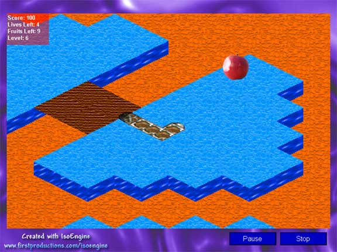

<div align="center">

## a\+ 3D Snake \- The best snake game on PSC\!\!


</div>

### Description

Tired of the old 2D snake game? Then 3D Snake will be a blast! Uses DirectX 8 and 3D isometric rendering. Features 10 levels, music that changes tempo depending on game speed, sound effects, help, options, pause, and more!
 
### More Info
 


<span>             |<span>
---                |---
**Submitted On**   |2003-02-13 18:02:38
**By**             |[\_andy\_](https://github.com/Planet-Source-Code/PSCIndex/blob/master/ByAuthor/andy.md)
**Level**          |Intermediate
**User Rating**    |5.0 (10 globes from 2 users)
**Compatibility**  |VB 5\.0, VB 6\.0
**Category**       |[Games](https://github.com/Planet-Source-Code/PSCIndex/blob/master/ByCategory/games__1-38.md)
**World**          |[Visual Basic](https://github.com/Planet-Source-Code/PSCIndex/blob/master/ByWorld/visual-basic.md)
**Archive File**   |[a\+\_3D\_Snak1543742132003\.zip](https://github.com/Planet-Source-Code/andy-a-3d-snake-the-best-snake-game-on-psc__1-43181/archive/master.zip)

### API Declarations

```
Please read the Instructions.txt file after downloading.
Enjoy!
```


